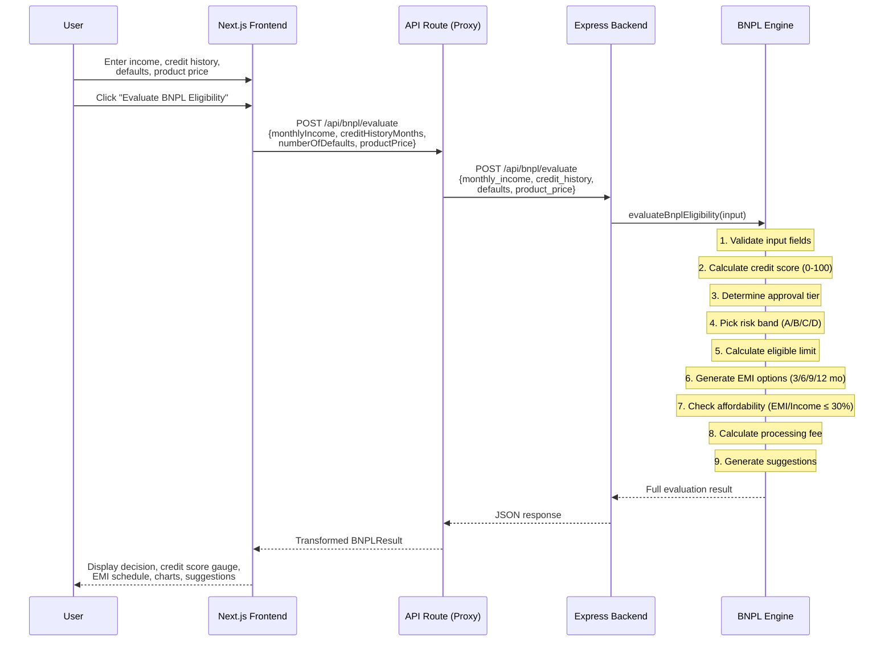
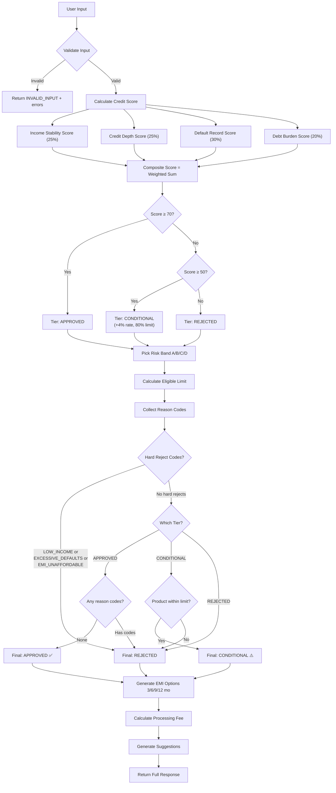

# 🚀 PayFlex BNPL — Smart Credit Eligibility Platform

> **Fiserv Hackathon 2026** · AI-Powered Buy Now Pay Later Eligibility Engine

<div align="center">


**A transparent, rule-based BNPL eligibility engine** that evaluates applicants using a **weighted credit scoring model (0-100)**, calculates EMI schedules using the **reducing balance method**, and provides actionable suggestions — all with a premium interactive frontend.

</div>

---

## 📋 Table of Contents

- [Architecture Overview](#-architecture-overview)
- [End-to-End Workflow](#-end-to-end-workflow)
- [Backend Logic & Formulas](#-backend-logic--formulas)
  - [Weighted Credit Scoring Model](#1-weighted-credit-scoring-model-0-100)
  - [Risk Band Assignment](#2-risk-band-assignment)
  - [Eligible Limit Calculation](#3-eligible-limit-calculation)
  - [EMI Calculation (Reducing Balance)](#4-emi-calculation---reducing-balance-method)
  - [Amortisation Schedule](#5-amortisation-schedule-generation)
  - [Affordability Check](#6-affordability-check)
  - [Processing Fee](#7-processing-fee)
  - [Decision Logic](#8-decision-logic--approval-tiers)
- [API Documentation](#-api-documentation)
- [Decision Engine Flowchart](#-decision-engine-flowchart)
- [Frontend Features](#-frontend-features)
- [Tech Stack](#-tech-stack)
- [Project Structure](#-project-structure)
- [Setup & Running](#-setup--running)
- [Testing](#-testing)

---

## 🏗 Architecture Overview

```
┌──────────────────────────────────────────────────────────────────────────┐
│                         USER BROWSER                                     │
│  ┌────────────────────────────────────────────────────────────────────┐  │
│  │  Next.js 16 Frontend (React 19 + Tailwind CSS 4 + Recharts)       │  │
│  │  ┌──────────┐ ┌──────────────┐ ┌─────────┐ ┌──────────────────┐  │  │
│  │  │ Input    │ │ Credit Score │ │ EMI     │ │ AI Assistant     │  │  │
│  │  │ Form     │ │ Gauge        │ │ Charts  │ │ (Gemini 2.0)     │  │  │
│  │  │ +Sliders │ │ +Breakdown   │ │ +Tables │ │ +Chat UI         │  │  │
│  │  └────┬─────┘ └──────────────┘ └─────────┘ └──────────────────┘  │  │
│  └───────┼──────────────────────────────────────────────────────────┘  │
│          │  POST /api/bnpl/evaluate                                     │
│  ┌───────▼──────────────────────────────────────────────────────────┐  │
│  │  Next.js API Route (Proxy Layer)                                  │  │
│  │  - Maps frontend field names → backend field names                │  │
│  │  - Transforms backend response → frontend types                   │  │
│  └───────┬──────────────────────────────────────────────────────────┘  │
└──────────┼───────────────────────────────────────────────────────────────┘
           │  POST /api/bnpl/evaluate
┌──────────▼───────────────────────────────────────────────────────────────┐
│                    EXPRESS.JS BACKEND (Port 4000)                         │
│  ┌────────────────────────────────────────────────────────────────────┐  │
│  │  BNPL Engine (bnplEngine.js)                                       │  │
│  │  ┌──────────────┐  ┌──────────────┐  ┌────────────────────────┐   │  │
│  │  │ Credit Score  │  │ Risk Band    │  │ EMI Calculator         │   │  │
│  │  │ Calculator    │  │ Selector     │  │ (Reducing Balance)     │   │  │
│  │  │ (4-factor     │  │              │  │                        │   │  │
│  │  │  weighted)    │  │              │  │                        │   │  │
│  │  └──────┬───────┘  └──────┬───────┘  └────────────┬───────────┘   │  │
│  │         │                  │                        │              │  │
│  │  ┌──────▼──────────────────▼────────────────────────▼───────────┐  │  │
│  │  │              Decision Engine                                  │  │  │
│  │  │  Score ≥ 70 → APPROVED                                       │  │  │
│  │  │  Score 50-69 → CONDITIONAL (+4% rate, 80% limit)             │  │  │
│  │  │  Score < 50 → REJECTED                                       │  │  │
│  │  └──────────────────────────────────────────────────────────────┘  │  │
│  └────────────────────────────────────────────────────────────────────┘  │
│  ┌────────────────────────────────────────────────────────────────────┐  │
│  │  Config (rules.js) — All thresholds, weights, and rates           │  │
│  └────────────────────────────────────────────────────────────────────┘  │
└──────────────────────────────────────────────────────────────────────────┘
```

---

## 🔄 End-to-End Workflow



### Step-by-step:

| Step | Component | Action |
|------|-----------|--------|
| 1 | **User** | Fills in Monthly Income, Credit History (months), Number of Defaults, Product Price |
| 2 | **Frontend** | Validates locally, sends POST to Next.js API route |
| 3 | **API Route** | Maps `monthlyIncome` → `monthly_income` (camelCase → snake_case) |
| 4 | **Backend** | Runs `evaluateBnplEligibility()` — the core decision engine |
| 5 | **Engine** | Calculates 4-factor weighted credit score (0-100) |
| 6 | **Engine** | Picks risk band based on defaults + credit history |
| 7 | **Engine** | Calculates eligible limit = income × 25% × multiplier |
| 8 | **Engine** | Generates EMI for 4 tenures using reducing balance formula |
| 9 | **Engine** | Checks affordability (EMI-to-Income ≤ 30%) |
| 10 | **Engine** | Determines final status: APPROVED / CONDITIONAL / REJECTED |
| 11 | **API Route** | Transforms response → frontend types (adds % formatting, etc.) |
| 12 | **Frontend** | Renders animated credit score gauge, EMI charts, suggestions |

---

## 🧮 Backend Logic & Formulas

### 1. Weighted Credit Scoring Model (0-100)

The core innovation — a **transparent, deterministic credit scoring model** that produces a composite score from 0 to 100 using four weighted factors:

```
Composite Score = Σ (weight_i × sub_score_i)
```

| Factor | Weight | Formula | Range |
|--------|--------|---------|-------|
| **Income Stability** | 25% | `min((income / product_price) / 5 × 100, 100)` × 0.5 if income < ₹15,000 | 0-100 |
| **Credit History Depth** | 25% | `min((credit_months / 36) × 100, 100)` | 0-100 |
| **Default Track Record** | 30% | `max(100 − (defaults × 35), 0)` | 0-100 |
| **Debt Burden Ratio** | 20% | `max((1 − (product_price / annual_income) / 0.5) × 100, 0)` | 0-100 |

#### Sub-score Details:

**Income Stability (25%)**
```
ratio = monthly_income / product_price
score = clamp((ratio / 5) × 100, 0, 100)

if monthly_income < 15000:
    score = score × 0.5   ← heavy penalty
```
Measures how comfortably the applicant's income covers the purchase. An income-to-product ratio of 5× or higher gives a perfect 100.

**Credit History Depth (25%)**
```
score = clamp((credit_months / 36) × 100, 0, 100)
```
Linear scaling. 36+ months of credit history = full score (100). Brand new credit users (0 months) score 0.

**Default Track Record (30%)** — *Highest weight*
```
score = clamp(100 − (defaults × 35), 0, 100)
```
Starts at 100. Each default deducts 35 points. After 3 defaults the score hits 0. This is the heaviest weighted factor because defaults are the strongest predictor of future repayment risk.

**Debt Burden Ratio (20%)**
```
annual_income = monthly_income × 12
debt_ratio = product_price / annual_income
score = clamp((1 − debt_ratio / 0.5) × 100, 0, 100)
```
Measures product price relative to annual income. A ratio of 5% or less = near-perfect. A ratio of 50% or higher = zero.

#### Composite Score → Approval Tier:

| Score Range | Tier | Description |
|-------------|------|-------------|
| **70-100** | ✅ APPROVED | Full approval at base risk band rate |
| **50-69** | ⚠️ CONDITIONAL | Approved with +4% rate increase & 80% limit reduction |
| **0-49** | ❌ REJECTED | Does not meet minimum scoring threshold |

---

### 2. Risk Band Assignment

Risk bands are determined by **defaults count** and **credit history length**:

```javascript
// Evaluated top-down; first matching band is selected
for (band of riskBands) {
    if (defaults <= band.maxDefaults && credit_history >= band.minCreditHistory) {
        return band;
    }
}
```

| Grade | Max Defaults | Min Credit History | Limit Multiplier | Annual Rate | Processing Fee | Max Product Price |
|-------|-------------|-------------------|-------------------|-------------|---------------|-------------------|
| **A** | 0 | 24 months | 1.20× | **0%** | 1.0% | ₹5,00,000 |
| **B** | 0 | 12 months | 1.00× | **10%** | 1.5% | ₹2,00,000 |
| **C** | 1 | 6 months | 0.85× | **14%** | 2.0% | ₹1,00,000 |
| **D** | 2 | 0 months | 0.70× | **18%** | 2.5% | ₹50,000 |

---

### 3. Eligible Limit Calculation

```
Base Limit     = Monthly Income × 25%
Eligible Limit = Base Limit × Risk Band Multiplier

If CONDITIONAL tier:
    Eligible Limit = Eligible Limit × 80%
```

**Example (Grade B, income ₹40,000):**
```
Base Limit     = 40,000 × 0.25 = ₹10,000
Eligible Limit = 10,000 × 1.0  = ₹10,000
```

---

### 4. EMI Calculation — Reducing Balance Method

The **standard reducing balance EMI formula** used by banks worldwide:

```
         P × r × (1+r)ⁿ
EMI  =  ─────────────────
           (1+r)ⁿ − 1

Where:
  P = Principal (product price)
  r = Monthly interest rate = Annual Rate / 12
  n = Number of months (tenure)
```

**Special case:** When rate = 0% (Grade A), EMI = P / n (flat split)

**Example (₹12,000 at 10% for 6 months):**
```
r = 0.10 / 12 = 0.008333
n = 6
factor = (1 + 0.008333)^6 = 1.05105
EMI = (12000 × 0.008333 × 1.05105) / (1.05105 − 1)
EMI = 105.11 / 0.05105
EMI ≈ ₹2,059.16
```

---

### 5. Amortisation Schedule Generation

For each month `i` (1 to n):

```
Interest_i  = Outstanding_Balance_{i-1} × Monthly_Rate
Principal_i = EMI − Interest_i
Balance_i   = Balance_{i-1} − Principal_i

Special: Last month → Principal_n = Remaining Balance (clears exactly)
```

This produces a detailed per-month table showing:
- EMI amount (constant)
- Interest component (decreasing)
- Principal component (increasing)
- Outstanding balance (decreasing to 0)

---

### 6. Affordability Check

```
EMI-to-Income Ratio = EMI / Monthly Income

Affordable if: EMI-to-Income ≤ 30% (0.30)
```

Each tenure option (3, 6, 9, 12 months) is independently evaluated. At least one tenure must be affordable for the application to pass the affordability check.

---

### 7. Processing Fee

```
Processing Fee = Product Price × Fee Rate

Fee Rate:
  Grade A → 1.0%
  Grade B → 1.5%
  Grade C → 2.0%
  Grade D → 2.5%

Total Cost of Credit = Total Payable (EMI × months) + Processing Fee
```

---

### 8. Decision Logic & Approval Tiers

The final decision combines the **credit score tier** with **hard rejection rules**:

```
Hard Rejection Codes (cannot be overridden):
  - LOW_INCOME           → income < ₹15,000
  - EXCESSIVE_DEFAULTS   → defaults > 2
  - EMI_NOT_AFFORDABLE   → no tenure has EMI/income ≤ 30%

Soft Rejection Codes (can pass with CONDITIONAL tier):
  - THIN_CREDIT_HISTORY          → credit history < 6 months
  - PRODUCT_EXCEEDS_LIMIT        → product price > eligible limit
  - PRODUCT_EXCEEDS_BAND_CAP     → product price > max for risk band

Decision Matrix:
┌─────────────────────┬─────────────────┬──────────────────────┐
│ Credit Score Tier   │ Hard Rejects?   │ Final Status         │
├─────────────────────┼─────────────────┼──────────────────────┤
│ APPROVED (≥70)      │ No              │ ✅ APPROVED          │
│ APPROVED (≥70)      │ Yes             │ ❌ REJECTED          │
│ CONDITIONAL (50-69) │ No              │ ⚠️ CONDITIONAL       │
│ CONDITIONAL (50-69) │ Yes             │ ❌ REJECTED          │
│ REJECTED (<50)      │ Any             │ ❌ REJECTED          │
└─────────────────────┴─────────────────┴──────────────────────┘
```

**CONDITIONAL adjustments:**
- Interest rate increased by **+4% p.a.**
- Eligible limit reduced to **80%** of calculated value

---

## 📡 API Documentation

### `POST /api/bnpl/evaluate`

**Request Body:**
```json
{
  "monthly_income": 40000,
  "credit_history": 12,
  "defaults": 0,
  "product_price": 12000
}
```

**Success Response (200):**
```json
{
  "status": "APPROVED | CONDITIONAL | REJECTED",
  "decision": {
    "approved": true,
    "riskGrade": "A",
    "reasonCodes": []
  },
  "creditScore": {
    "composite": 85.5,
    "tier": "APPROVED",
    "breakdown": {
      "incomeStability": { "score": 100, "weight": 0.25, "weighted": 25 },
      "creditDepth": { "score": 66.67, "weight": 0.25, "weighted": 16.67 },
      "defaultRecord": { "score": 100, "weight": 0.30, "weighted": 30 },
      "debtBurden": { "score": 95, "weight": 0.20, "weighted": 19 }
    }
  },
  "eligibility": {
    "eligibleLimit": 24000,
    "productPrice": 12000
  },
  "financials": {
    "processingFee": 120,
    "effectiveAnnualRate": 0.0
  },
  "recommendedTenure": 3,
  "suggestions": ["You qualify for 0% interest — a no-cost EMI!"],
  "options": [
    {
      "months": 3,
      "annualRate": 0.0,
      "emi": 4000,
      "emiToIncomeRatio": 0.05,
      "affordable": true,
      "totalPayable": 12000,
      "totalInterest": 0,
      "totalCostOfCredit": 12120,
      "schedule": [
        { "month": 1, "emi": 4000, "principal": 4000, "interest": 0, "balance": 8000 },
        { "month": 2, "emi": 4000, "principal": 4000, "interest": 0, "balance": 4000 },
        { "month": 3, "emi": 4000, "principal": 4000, "interest": 0, "balance": 0 }
      ]
    }
  ]
}
```

### `GET /api/bnpl/rules`

Returns the current rule configuration (risk bands, tenures, thresholds).

### `GET /api/bnpl/score-breakdown`

Returns documentation of the scoring model (factor names, weights, descriptions).

### `GET /health`

Health check endpoint: `{ "ok": true, "service": "bnpl-eligibility-simulator" }`

---

## 🔀 Decision Engine Flowchart



---

## 🎨 Frontend Features

### Interactive Components
| Feature | Description |
|---------|-------------|
| 🎚️ **Slider Controls** | Range sliders alongside number inputs for intuitive data entry |
| 📊 **Credit Score Gauge** | Animated SVG circular gauge (0-100) with color transitions (red→amber→green) |
| 📈 **Score Breakdown Bars** | Animated progress bars showing all 4 scoring factors |
| 📋 **Expandable EMI Rows** | Click to expand and see detailed per-tenure breakdown |
| 📊 **Stacked Bar Chart** | Principal vs Interest split visualization using Recharts |
| 🃏 **3D Credit Card** | Three.js animated credit card with approval/rejection state |
| 🤖 **AI Chat Assistant** | Gemini 2.0 Flash powered BNPL advisor |
| 🕒 **Click-to-Reload History** | Click any past evaluation to reload its inputs |
| 🌙 **Dark Mode Toggle** | Persisted dark/light theme with localStorage |
| ✨ **Micro-animations** | Staggered fadeInUp, slideIn, shimmer, glow-pulse effects |
| 🔲 **Glassmorphism** | Frosted glass cards with backdrop blur |
| 🌊 **Hero Section** | Animated gradient hero with stat cards and wave divider |
| 📑 **Preset Scenarios** | 4 quick-test scenarios with descriptions |
| ℹ️ **Tooltip Help** | Hover tooltips explaining each input field |

---

## 🛠 Tech Stack

| Layer | Technology | Purpose |
|-------|-----------|---------|
| **Backend** | Node.js + Express 5 | REST API server |
| **Frontend** | Next.js 16 + React 19 | SSR/CSR web application |
| **Styling** | Tailwind CSS 4 + Custom CSS | Design system + animations |
| **Charts** | Recharts 2.15 | EMI comparison visualisation |
| **3D** | Three.js + React Three Fiber | Credit card visualisation |
| **AI Chat** | Google Gemini 2.0 Flash | Conversational assistant |
| **UI Kit** | Radix UI + shadcn/ui | Accessible component library |
| **Types** | TypeScript 5.7 | Type safety |

---

## 📁 Project Structure

```
PayFlex BNPL/
├── Backend/
│   ├── src/
│   │   ├── config/
│   │   │   └── rules.js          ← All thresholds, weights, rates
│   │   ├── core/
│   │   │   └── bnplEngine.js     ← Credit scoring + EMI + decision logic
│   │   └── server.js             ← Express API endpoints
│   ├── tests/
│   │   └── bnplEngine.test.js    ← 42 comprehensive test cases
│   └── package.json
│
├── Frontend/
│   ├── app/
│   │   ├── api/
│   │   │   ├── bnpl/evaluate/route.ts  ← Backend proxy (field mapping)
│   │   │   └── chat/route.ts           ← Gemini AI chat endpoint
│   │   ├── globals.css            ← Animations, glassmorphism, gradients
│   │   ├── layout.tsx             ← Root layout + Google Fonts
│   │   └── page.tsx               ← Main dashboard page
│   ├── components/
│   │   ├── dashboard/
│   │   │   ├── header.tsx         ← Glassmorphism header + dark mode
│   │   │   ├── input-form.tsx     ← Form with sliders + presets
│   │   │   ├── decision-summary.tsx ← Status + metrics + score breakdown
│   │   │   ├── credit-score-gauge.tsx ← Animated SVG score gauge
│   │   │   ├── emi-schedule.tsx   ← Expandable EMI table
│   │   │   ├── emi-chart.tsx      ← Stacked bar chart
│   │   │   ├── reason-codes.tsx   ← Animated rejection/approval codes
│   │   │   ├── suggestions.tsx    ← Numbered actionable tips
│   │   │   ├── evaluation-history.tsx ← Click-to-reload history
│   │   │   ├── credit-card-3d.tsx ← Three.js credit card
│   │   │   └── ai-assistant.tsx   ← Gemini chat bot
│   │   └── ui/                    ← shadcn/ui component library
│   ├── lib/
│   │   ├── types.ts               ← TypeScript interfaces
│   │   └── utils.ts               ← Utility functions
│   └── package.json
│
└── README.md                      ← This file
```

---

## 🚀 Setup & Running

### Prerequisites
- Node.js 18+
- npm / pnpm

### 1. Backend

```bash
cd Backend
npm install
npm start
# ✅ BNPL API running on http://localhost:4000
```

### 2. Frontend

```bash
cd Frontend
pnpm install
```

Create a `.env.local` file:
```env
# Google Gemini API Key for AI Assistant
GOOGLE_GENERATIVE_AI_API_KEY=your_api_key_here
```

```bash
pnpm dev
# ✅ Frontend running on http://localhost:3000
```

### 3. Both servers must be running
- Backend: `http://localhost:4000` — handles evaluation logic
- Frontend: `http://localhost:3000` — serves the UI, proxies API calls to backend

---

## 🧪 Testing

### Run Backend Tests

```bash
cd Backend
npm test
```

**Output: 42 tests across 11 test suites:**

| Suite | Tests | Description |
|-------|-------|-------------|
| Credit Score — Weighted Model | 6 | Score calculation, sub-scores, penalties |
| Risk Band A — Excellent Profile | 5 | Grade A approval, 0% rate, processing fee |
| Risk Band B — Good Profile | 4 | Grade B limits, 10% rate |
| Risk Band C — Fair Profile | 1 | Grade C evaluation |
| Risk Band D — High Risk Profile | 1 | Grade D assignment |
| Conditional Approval Tier | 3 | Rate increase, limit reduction |
| Rejection Scenarios | 4 | Low income, thin history, excessive defaults |
| Invalid Input Handling | 2 | Zero/negative/empty validation |
| EMI Schedule & Affordability | 6 | Tenure options, flat EMI, recommended tenure |
| Suggestions Generation | 4 | Contextual suggestions |
| Processing Fees | 3 | Fee calculation, total cost of credit |
| Problem Statement Sample | 1 | Exact sample from problem statement |
| Response Structure | 2 | Complete response schema validation |

---

## 📊 Sample Scenarios

| Scenario | Income | Credit Mo. | Defaults | Product | Score | Grade | Status |
|----------|--------|-----------|----------|---------|-------|-------|--------|
| **Strong Approval** | ₹80,000 | 30 | 0 | ₹12,000 | ~90 | A | ✅ APPROVED |
| **Exceeds Limit** | ₹40,000 | 18 | 0 | ₹12,000 | ~75 | B | ❌ REJECTED |
| **Low Income** | ₹10,000 | 12 | 1 | ₹5,000 | ~35 | C | ❌ REJECTED |
| **Defaults Rejection** | ₹60,000 | 24 | 4 | ₹10,000 | ~30 | D | ❌ REJECTED |

---

## 👥 Team

Built for **Fiserv Hackathon 2024** · Powered by PayFlex

---

<div align="center">

**⚡ PayFlex BNPL** — *Making credit decisions transparent, accurate, and instant.*

</div>
